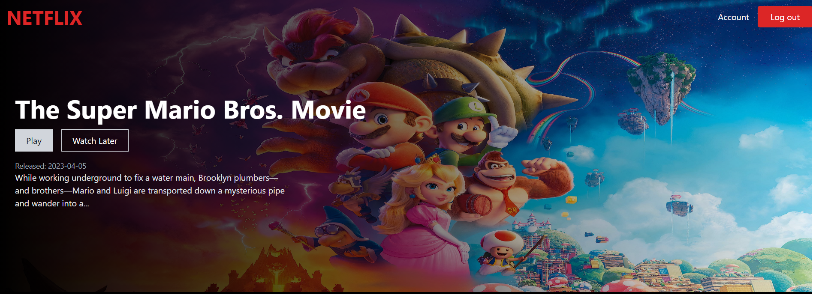

# Netflix
- User authentication and account management.
- Dynamic content loading and smooth UI transitions.
- Integration with **TMDB** for fetching movie and show data.
- Responsive design for optimal viewing across devices.
  
<div align="center">
      
</div>
## Get Started
### Installation

1. **_Clone the repository_**

```sh
git clone https://github.com/nour-aldin/Netflix.git
```

2. **_Navigate to repository directory_**

```sh
$ cd Netflix
```

3. **_Install dependencies_**

```sh
$ npm install
```

### Running

1. **_Compile and hot-reload for development_**

```sh
$ npm run dev
```

2. **_Compile, prefix and minify for production_**

```sh
$ npm run build
```

---

## 💻 Built With

- **React**
- **tailwindcss**
- **firebase**

---

## 🎥 Demo

https://github.com/nour-aldin/Netflix/assets/56984371/d2f78ca9-a817-49f1-a42a-ef9836d69d59

